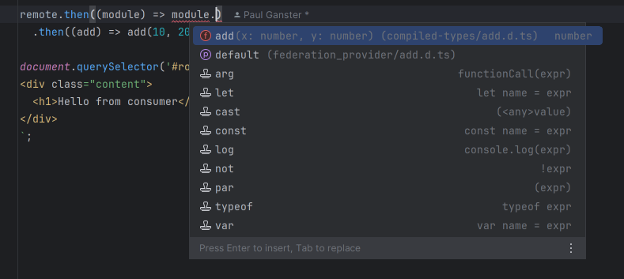
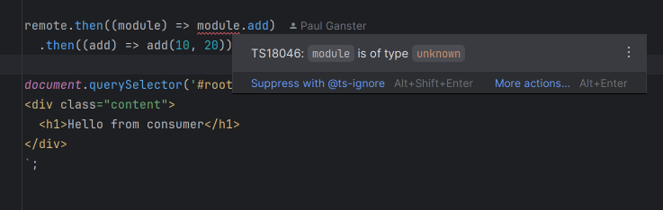

# Federation Runtime API types not working as expected for `loadRemote`
According to the [module federation guide](https://module-federation.io/guide/basic/type-prompt.html#federation-runtime-api-type-prompt),
`loadRemote` should return the inferred types for the supplied remote, but it doesn't. The returned promise always resolves an `unknown`.

## Reproduction
1. Call yarn in `consumer/` and `producer/`
2. Call `yarn tsc` in `consumer/`

### Expected Behavior
Typescript checks should pass

### Actual Behavior
Typescript fails with the following message
```
src/bootstrap.ts:6:25 - error TS18046: 'module' is of type 'unknown'.

remote.then((module) => module.add)
                        ~~~~~~
```

## Further notes
- If you start both `consumer` and `producer` via `yarn dev`, you can see that in spite of the Typescript error, 
the import works, as it logs `added 10, 20` in the console.
- In `consumer/@mf-types/federation_provider/apis.d.ts`, the
remote types are correctly generated. Also `consumer/@mf-types/index.d.ts` correctly has generated the correct module declarations
for `loadRemote`.
- Curiously, the IDE (in my case IntelliJ U) prompts the correct types:



but the Typescript compiler in the IDE complains:




